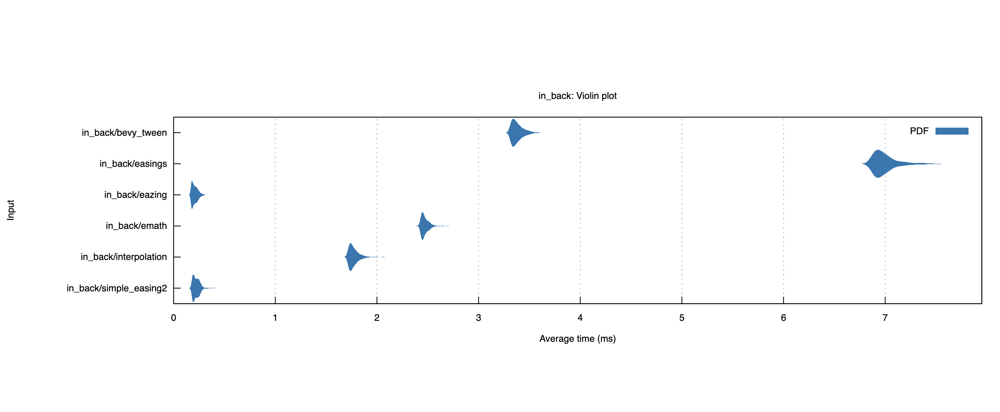

# eazing.

[](https://github.com/invisageable/zo)


---

> *eazing — The blazingly fast and mathematically optimized `easing functions` kit.*

[Home](.)

## about.

eazing iS AN iNNoVATioNAL, AToMiC AND ENHANCED `EASiNG FuNCTioNS` KiT FoR CREATiVE, GAMERS, PRoGRAMMERS, SCiENTiSTS, ETC. WRiTTEN iN RuST.    

eazing iS EXTREMELY FAST AND METiCuLouSLY oPTiMiZED iTS A PERFECT MATCH FoR PRECiSioN oR SoPHiSTiCATED PROGRAMS — SuCH AS Gui, GAME ENGiNE, PLoTS, WEB AND NATiVE APPLiCATioN.    

## example.

**uSiNG AN EASiNG FuNCTioN.**

```rs
use eazing::backtracking::back::InBack;
use eazing::Curve;

fn main() {
  println!("backtracking:in_back", InBack.y(0.5));
}
```

**uSiNG THE `ease` FuNCTioN.**

```rs
use eazing::{ease, Easing};

fn main() {
  let mut time = 0.0; // current time.
  let duration = 4.0; // animation time.
  let mut p = 0.0;

  while time <= duration {
    // inside this loop until the time expires.
    p = ease(Box::new(Easing::InOutBack), time / duration, 0.0, 1.0); // interpolates "p" value from 0 to 1.
    time += 1.0; // adds one millisecond to the elapsed time..
  }
}
```

MoRE EXAMPLES ARE ALREADY iMPLEMENTS iN THE [`examples`](./examples) FoLDER.    

## functions.

- [x] EASiNG.
  - [x] PoLYNoMiAL.
    - [x] LiNEAR.
    - [x] QuADRATiC.
    - [x] CuBiC.
    - [x] QuARTiC.
    - [x] QuiNTiC.
    - [x] SEXTiC.
    - [x] SEPTiC.
    - [x] oCTiC.
    - [x] NoNiC.
    - [x] DECiC.
    - [x] HECTiC.
  - [x] TRiGoNoMETRiC.
    - [x] SiNE.
    - [x] CiRCLE.
  - [x] EXPoNENTiAL.
    - [x] EXPo2.
    - [x] EXPoE.
  - [x] LoGARiTHMiC.
    - [x] LoG10.
  - [x] RooT.
    - [x] SQRT.
  - [x] oSCiLLAToRY.
    - [x] ELASTiC.
    - [x] BouNCE.
  - [x] BACKTRACKiNG.
    - [x] BACK.
- [x] iNTERPoLATioN.
  - [x] LiNEAR.
    - [x] LERP.
  - [x] PoLYNoMiAL.
    - [x] SMooTHSTEP.
    - [x] SMooTHERSTEP
    - [x] CuBiC.
    - [x] QuARTiC.
    - [x] QuiNTiC.
    - [ ] LAGRANGE.
    - [ ] NEWToN.
  - [x] RATioNAL.
    - [x] QuADRATiC
    - [x] CuBiC.
  - [x] PiECEWiZE.
    - [ ] PoLYNoMiAL
    - [x] QuADRATiC
  - [x] TRiGoNoMETRiC
    - [x] SiNuSoiDAL.

## benches.

BENCHES ARE DoNE iN CoMPARiSON BETWEEN `bevy_tween`, `easings`, `emath`, `glissade`, `interpolation`, `keyframe`, `simple-easing2` CRATES. MoST oF THEM ARE FoLLoW THE RoBERT PENNER'S EASiNG FuNCTioNS, THEY oNLY iMPLEMENTED THE BASiCS oNE. REGARDiNG PERFoRMANCE SoME oF ouR iMPLEMENTATioNS ARE SLiGHTLY FASTER, So DEPENDiNG YouR NEEDED, You SHouLD TRY eazing. THE SAMPLE BELoW CoNFiRM THAT ouR EASiNG FuNCTiONS ARE PRETTY WELL oPTiMiZED.



You CAN RuN BENCHMARKS WiTH THE FoLLoWiNG CoMMAND: `cargo bench -- <bench-name>`.   

HERE, THE LiST oF ALL BENCHES:    

| BENCH NAME         | CoMMAND                           |
| :----------------- | :-------------------------------- |
| `linear`           | `cargo bench -- linear`           |
| `in_quadratic`     | `cargo bench -- in_quadratic`     |
| `out_quadratic`    | `cargo bench -- out_quadratic`    |
| `in_out_quadratic` | `cargo bench -- in_out_quadratic` |
| `in_cubic`         | `cargo bench -- in_cubic`         |
| `out_cubic`        | `cargo bench -- out_cubic`        |
| `in_out_cubic`     | `cargo bench -- in_out_cubic`     |
| `in_quartic`       | `cargo bench -- in_quartic`       |
| `out_quartic`      | `cargo bench -- out_quartic`      |
| `in_out_quartic`   | `cargo bench -- in_out_quartic`   |
| `in_quintic`       | `cargo bench -- in_quintic`       |
| `out_quintic`      | `cargo bench -- out_quintic`      |
| `in_out_quintic`   | `cargo bench -- in_out_quintic`   |
| `in_sextic`        | `cargo bench -- in_sextic`        |
| `out_sextic`       | `cargo bench -- out_sextic`       |
| `in_out_sextic`    | `cargo bench -- in_out_sextic`    |
| `in_septic`        | `cargo bench -- in_septic`        |
| `out_septic`       | `cargo bench -- out_septic`       |
| `in_out_septic`    | `cargo bench -- in_out_septic`    |
| `in_octic`         | `cargo bench -- in_octic`         |
| `out_octic`        | `cargo bench -- out_octic`        |
| `in_out_octic`     | `cargo bench -- in_out_octic`     |
| `in_nonic`         | `cargo bench -- in_nonic`         |
| `out_nonic`        | `cargo bench -- out_nonic`        |
| `in_out_nonic`     | `cargo bench -- in_out_nonic`     |
| `in_decic`         | `cargo bench -- in_decic`         |
| `out_decic`        | `cargo bench -- out_decic`        |
| `in_out_decic`     | `cargo bench -- in_out_decic`     |
| `in_hectic`        | `cargo bench -- in_hectic`        |
| `out_hectic`       | `cargo bench -- out_hectic`       |
| `in_out_hectic`    | `cargo bench -- in_out_hectic`    |
| `in_sine`          | `cargo bench -- in_sine`          |
| `out_sine`         | `cargo bench -- out_sine`         |
| `in_out_sine`      | `cargo bench -- in_out_sine`      |
| `in_circle`        | `cargo bench -- in_circle`        |
| `out_circle`       | `cargo bench -- out_circle`       |
| `in_out_circle`    | `cargo bench -- in_out_circle`    |
| `in_expoe`         | `cargo bench -- in_expoe`         |
| `out_expoe`        | `cargo bench -- out_expoe`        |
| `in_out_expoe`     | `cargo bench -- in_out_expoe`     |
| `in_log10`         | `cargo bench -- in_log10`         |
| `out_log10`        | `cargo bench -- out_log10`        |
| `in_out_log10`     | `cargo bench -- in_out_log10`     |
| `in_sqrt`          | `cargo bench -- in_sqrt`          |
| `out_sqrt`         | `cargo bench -- out_sqrt`         |
| `in_out_sqrt`      | `cargo bench -- in_out_sqrt`      |
| `in_elastic`       | `cargo bench -- in_elastic`       |
| `out_elastic`      | `cargo bench -- out_elastic`      |
| `in_out_elastic`   | `cargo bench -- in_out_elastic`   |
| `in_bounce`        | `cargo bench -- in_bounce`        |
| `out_bounce`       | `cargo bench -- out_bounce`       |
| `in_out_bounce`    | `cargo bench -- in_out_bounce`    |
| `in_back`          | `cargo bench -- in_back`          |
| `out_back`         | `cargo bench -- out_back`         |
| `in_out_back`      | `cargo bench -- in_out_back`      |

## contributing.

FEEL FREE To oPEN AN iSSuE iF You WANT To CoNTRiBuTE. ALSo You CAN CoNTACT uS AT THE [at] CoMPiLoRDS [dot] HouSE.   

## credits.

> *THANKS To THE "CoDE PoET" AKA MiCHAELANGE007 FoR HiS [TuToRiAL](https://github.com/Michaelangel007/easing).*

## license.

[APACHE](https://github.com/invisageable/zov/blob/main/.github/LICENSE-APACHE) — [MIT](https://github.com/invisageable/zov/blob/main/.github/LICENSE-MIT)   

CoPYRiGHT© **10** JuLY **2024** — *PRESENT, [@invisageable](https://github.com/invisageable).*     
